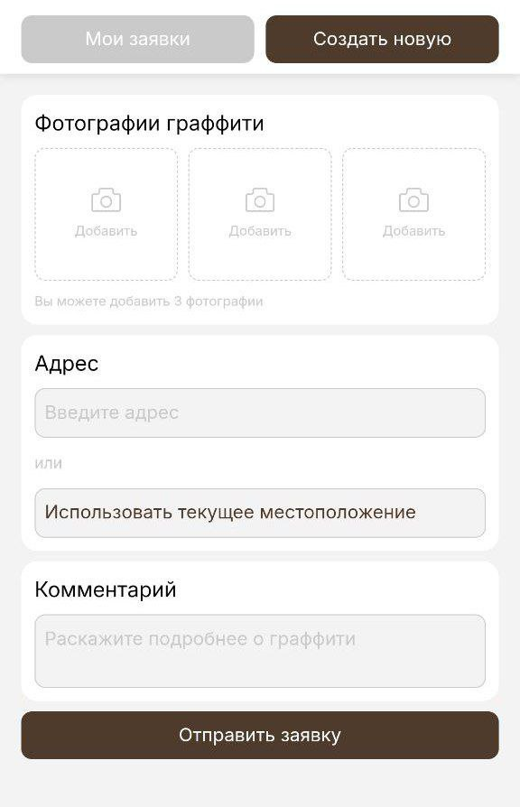

# Graffity Report Telegram mini-app
<p align="center">
  <a href="https://skillicons.dev">
    
  </a>
</p>

---
## Короткое описание
Приложение позволяет отправить фотографию и адрес незаконного граффити. После обработки заявки модерацией, в администрацию района будет отправлена заявка на удаление. Статус своей заявки можно отслеживать.

---
# Start
## На сервере Railway

- Сделать форк репозитория на GitHub
- Создать проект в Railway и подключить репозиторий
- Настроить переменные окружения в Railway Variables
- Railway автоматически обнаружит `Dockerfile` и запустит приложение
- Настроить GitHub Pages для статических файлов (опционально)


## На виртуальной машине

1. **Клонирование репозитория:**
   ```bash
   git clone https://github.com/tau-lavender/graffity_report.git
   cd graffity_report
   ```

2. **Создание `.env` файла с переменными окружения:**
   ```bash
   cat > .env << 'EOF'
   # PostgreSQL
   DATABASE_URL=postgresql://graffiti_user:<ваш пароль>@postgres:5432/graffiti_db
   POSTGRES_USER=graffiti_user
   POSTGRES_PASSWORD=<ваш пароль>
   POSTGRES_DB=graffiti_db

   # MinIO (S3-совместимое хранилище)
   MINIO_ENDPOINT=http://minio:9000
   MINIO_ACCESS_KEY=minioadmin
   MINIO_SECRET_KEY=minioadmin123
   MINIO_BUCKET=graffiti-reports

   # Админ-панель (SHA-512 хэш пароля)
   ADMIN_PASSWORD_HASH=<ваш пароль>

   # Yandex Maps API (получить на https://developer.tech.yandex.ru)
   YANDEX_MAPS_API_KEY=<ваш ключ>
   EOF
   ```

3. **Генерация SHA-512 хэша для пароля админа:**
   ```bash
   echo -n "your_password" | sha512sum
   ```
   Скопируйте полученный хэш в `.env` → `ADMIN_PASSWORD_HASH`

4. **Запуск приложения:**
   ```bash
   docker-compose up -d
   ```

5. **Проверка статуса:**
   ```bash
   docker-compose ps
   docker-compose logs -f app
   ```

6. **Инициализация базы данных (первый запуск):**
   ```bash
   curl -X POST http://localhost:8080/api/db/init
   ```

*Нужно менять ссылку mini-app в тг боте или спользовать второго для локальной отладки*

---
# Использование бота

- Добавить от 1 до 3 фото
- Заполнить все поля
- Отправить заявку

---
## Авторы
Курсовой проект студентов МАИ (группа М8О-104БВ-25):
- Бычков Евгений
- Ефимова Дарья
- Слепцов Михаил
- Иванющенко Эрик
- Журавлёв Роман
